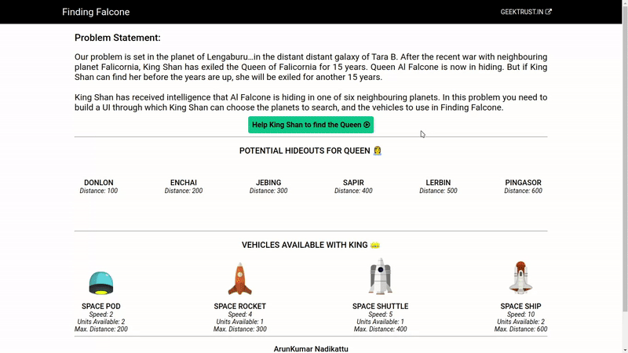

# Finding Falcone

This project is a solution for [GeekTrust](https://www.geektrust.in/) FrontEnd Space Challenge. More details about challenge can be found [here](https://www.geektrust.in/coding-problem/frontend/space).

> My first project in TypeScript React

## Problem Statement

Our problem is set in the planet of Lengabur in the distant distant galaxy of Tara B. After the recent war with neighbouring planet Falicornia, **King Shan** has exiled the Queen of Falicornia for 15 years. **Queen Al Falcone** is now in hiding. But if King Shan can find her before the years are up, she will be exiled for another 15 years.

King Shan has received intelligence that Al Falcone is hiding in one of six neighbouring planets. In this problem you need to build a UI through which King Shan can choose the planets to search, and the vehicles to use in Finding Falcone.

### [Link to the solution](https://finding-falcone-gt.netlify.app/)

## Scripts

> In this project, [yarn](https://yarnpkg.com/) is used. If [npm](https://www.npmjs.com/package/npm) is being used, first delete [yarn lock file](/yarn.lock) before installing dependencies.

|                            | [yarn](https://yarnpkg.com/) | [npm](https://www.npmjs.com/package/npm) |                                                        |
| -------------------------- | ---------------------------- | ---------------------------------------- | ------------------------------------------------------ |
| Installing Dependencies    | `yarn`                       | `npm install`                            |                                                        |
| To run in development mode | `yarn start`                 | `npm start`                              | & open [http://localhost:3000](http://localhost:3000)  |
| For production build       | `yarn build`                 | `npm build`                              | & run use [serve](https://www.npmjs.com/package/serve) |
